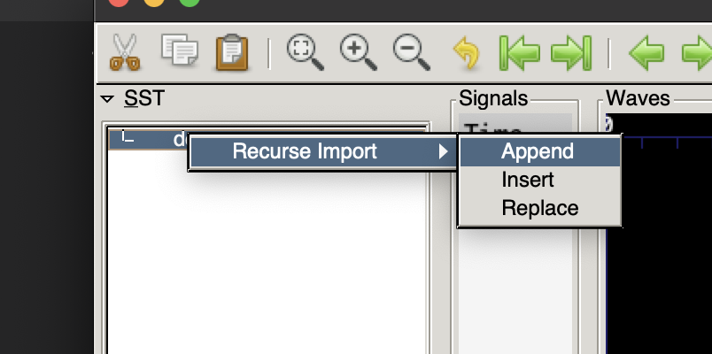

## Running proof

```
$ sby -f demo.sby
```

Note: use '-f' option to remove the 'demo' folder that is created by symbioyosys with its' results.  Symbiyosys is unable to run if the 'demo' folder already exists and it is not removed.

## View trace of a failed proof

```
$ gtkwave demo/engine_0/trace.vcd
```

Note: In GTKWave, right click on 'demo' in the SST panel, and use menu options to 'Recurse Input' and 'Append' to add the 'counter' and 'clk' signals from the 'demo' design to the 'Waves' panel.



